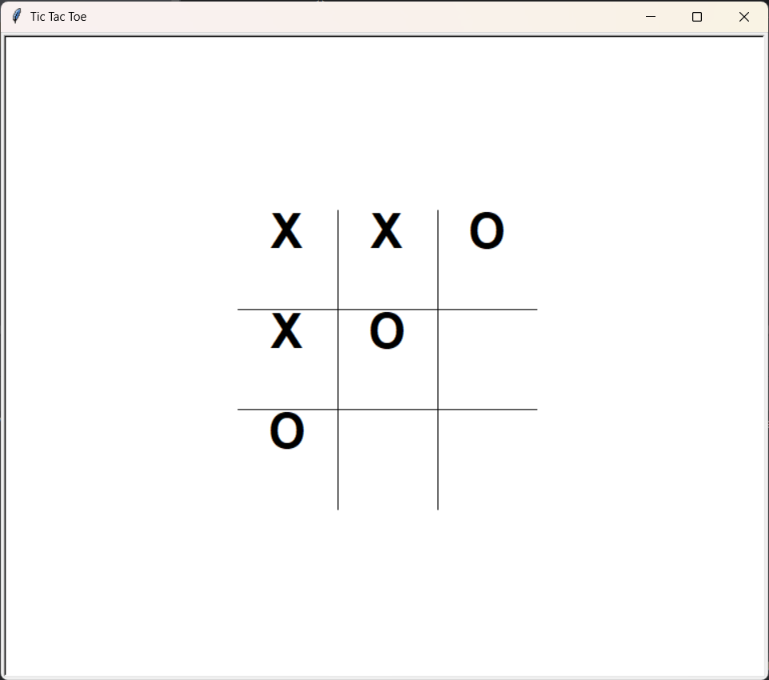

# Tic-Tac-Toe Game

A GUI-based Tic-Tac-Toe game developed in Python featuring multiple gameplay modes, game persistence, and AI-assisted code review. This project was created as part of a Python programming course focused on software development fundamentals, computational thinking, and responsible use of AI development tools.

## Features

- Human vs Human gameplay
- Human vs Computer (Random AI)
- Human vs Computer (Strategic AI)
- Graphical user interface (GUI)
- Save and load game functionality
- Input validation and game state management
- Game history tracking

## Screenshot



## Technologies Used

- Python
- Git
- GitHub

## AI-Assisted Development

AI tools, including ChatGPT and Claude, were used primarily for code review, debugging support, and evaluating alternative implementation approaches. 
These tools helped improve code quality and development efficiency while maintaining full transparency throughout the development process.

## Learning Outcomes

Through this project, I strengthened my skills in:

- Python programming
- Modular software design
- GUI development
- File handling and persistence
- Debugging and testing
- Version control using Git and GitHub
- AI-assisted software development workflows

## Project Structure

The project is organized into multiple modules to separate responsibilities such as:

- Game logic
- Board management
- AI player behavior
- User input handling
- Game history tracking
- Data persistence
- User interface

## How to Run

Clone the repository:

```bash
git clone https://github.com/Hiladolev/tic-tac-toe.git
```

Navigate to the project directory:

```bash
cd tic-tac-toe
```

Run the application:

```bash
python main.py
```

## About

This project demonstrates the application of Python programming principles, modular design practices, and AI-assisted development techniques in the implementation of a complete interactive game.

---

Developed by **Hila Dolev**
